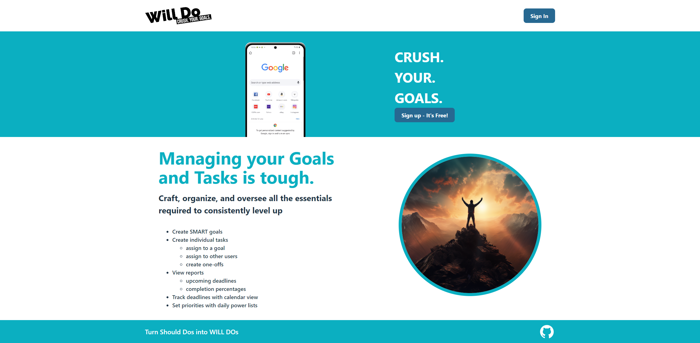
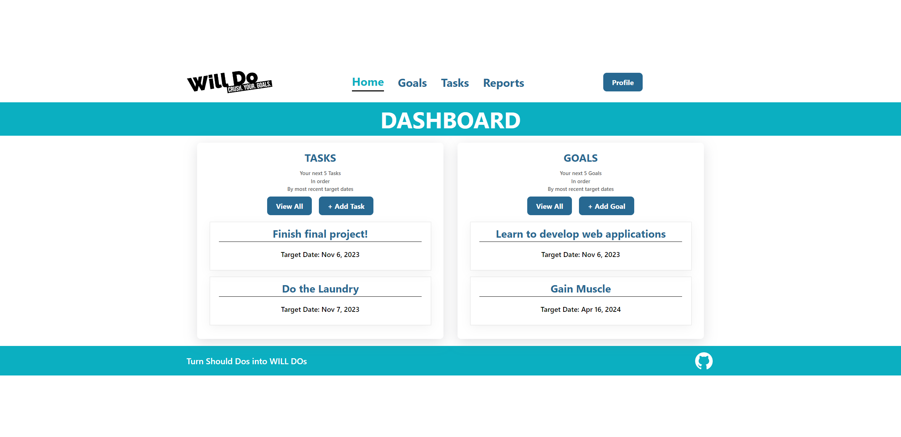
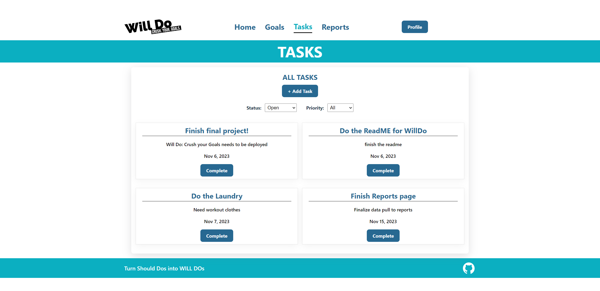
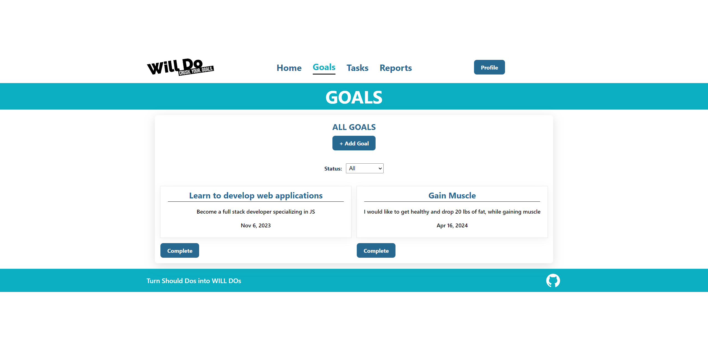
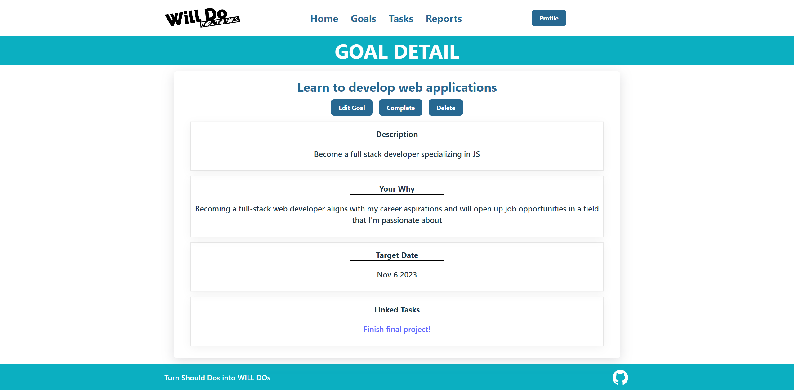
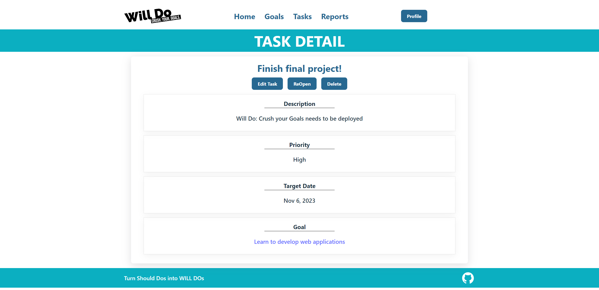
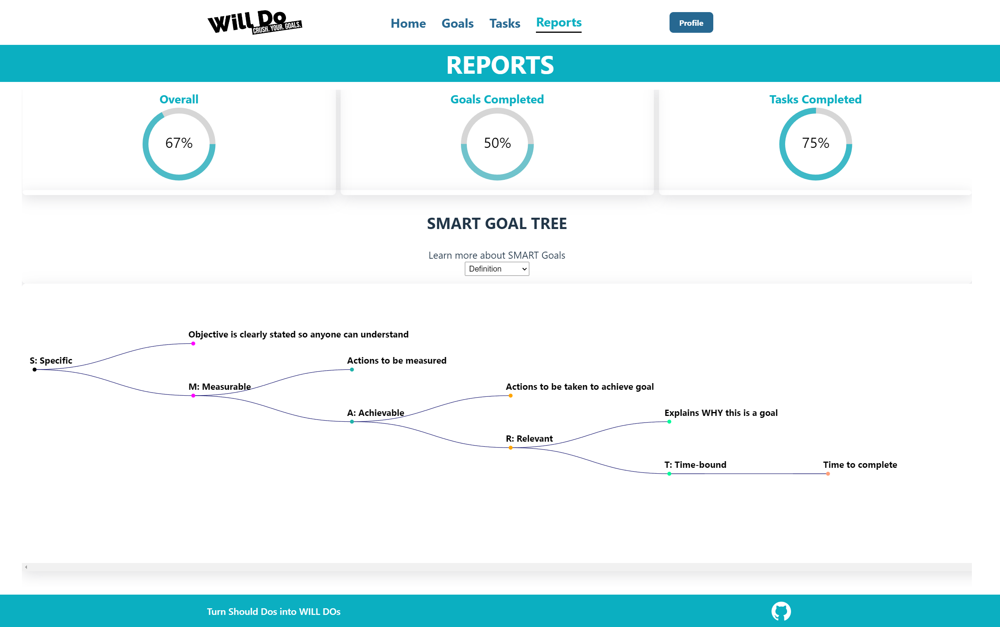

  

  
# Will Do: Crush Your Goals

## Table of Contents

  

  
  
  
  
  
  

### Description

Will Do is a task management application that is designed to help users create S.M.A.R.T goals and tasks.

- **S = Specific**: Your objective (goal/task) should be clearly stated so anyone can read and understand it. They should also be able to infer what will be done and who will do it.
- **M = Measurable**: This is where you would identify how this objective was/will be accomplished. This is normally in terms of quantity, but quality also works.
- **A = Attainable**: Ensure that you have the time, manpower, resources and authority to accomplish the objective.
- **R = Relevant**: The objective should be aligned with your values and long-term goals/aspirations
- **T = Time-based**: Set a realistic, yet ambitious end date to clarify objective priority and increase motivation

The goal of this application is to promote SMART goal setting and help users achieve their desired goals no matter how ambitious they may be.

#### Key Features:

- **Goal Creation:** Users can create a goal by using the SMART acronym. This is the starting block of a users journey for change.

- **Task Creations:** Create tasks that can be stand alone, such as "taking out the trash", to measurables for a goal to keep a user on track to achieving their time goal.

- **Status Tracking:** Goals and Tasks can be tracked via them being open and complete.

- **Urgency Classification:** Tasks are categorized by urgency levels, helping prioritize and address critical tasks promptly.

- **Archiving:** Completed or outdated goals and tasks can be archived for reference, keeping the active goals and tasks list clutter-free. These can still be found using our drop down filters.

- **User-Friendly Interface:** The system offers an intuitive and user-friendly interface for both users and technical support staff, ensuring easy navigation and usage.

- **Security and Privacy:** Robust security measures protect sensitive information, ensuring data privacy and compliance with company policies.

By implementing our Will Do: Crush your Goals application, you can streamline your organization of daily tasks and goals as well as your long term ones. Having one place to view and modify these items will see improved performance and percentage of completion of your goals and tasks. It also takes the headache out of having to remember it yourself or where you wrote it down.

(<a href="#back_to_top">back to top</a>)

## Built With

This application relies on the following software:

- [![Node][Node.js]][node-url]
- [![React][React]][React-url]
- [![React Router][ReactRouter]][rr-url]
- [![Express][Express.js]][Express-url]
- [![MongoDB][MongoDB]][Mongo-url]
- [![D3][D3.js]][D3-url]
- [![Heroku][Heroku]][Heroku-url]

(<a href="#back_to_top">back to top</a>)

## Usage

This code is allowed for learning setting. Please refer to the license for further details.

Example photos:

  
Home
  

  
Dashboard post Sign Up / Login 
  

  
Page for All tasks
    
  
Page for All goals
  
  
Single Goal Page 
  
  
Single Task Page 
  
  
Report Page 
  

## Contributing

Everyone is welcome to send contributions up for review through github! All contributions will certainly be reviewed and committed if found valuable and error free!

(<a href="#back_to_top">back to top</a>)

## License

MIT License

Copyright (c) 2023 ultimated1228

Permission is hereby granted, free of charge, to any person or organization
obtaining a copy of the software and accompanying documentation covered by
this license (the "Software") to use, reproduce, display, distribute,
execute, and transmit the Software, and to prepare derivative works of the
Software, and to permit third-parties to whom the Software is furnished to
do so, all subject to the following:

The copyright notices in the Software and this entire statement, including
the above license grant, this restriction and the following disclaimer,
must be included in all copies of the Software, in whole or in part, and
all derivative works of the Software, unless such copies or derivative
works are solely in the form of machine-executable object code generated by
a source language processor.

THE SOFTWARE IS PROVIDED "AS IS", WITHOUT WARRANTY OF ANY KIND, EXPRESS OR
IMPLIED, INCLUDING BUT NOT LIMITED TO THE WARRANTIES OF MERCHANTABILITY,
FITNESS FOR A PARTICULAR PURPOSE, TITLE AND NON-INFRINGEMENT. IN NO EVENT
SHALL THE COPYRIGHT HOLDERS OR ANYONE DISTRIBUTING THE SOFTWARE BE LIABLE
FOR ANY DAMAGES OR OTHER LIABILITY, WHETHER IN CONTRACT, TORT OR OTHERWISE,
ARISING FROM, OUT OF OR IN CONNECTION WITH THE SOFTWARE OR THE USE OR OTHER
DEALINGS IN THE SOFTWARE.

Fore more details on the [MIT License](https://opensource.org/licenses/MIT) please click the link, or check out the license file in the repo.

(<a href="#back_to_top">back to top</a>)

## Contact

You can get in touch with the creators through:

- Steve Meyer
  - [Steve Meyer Github](https://github.com/ultimated1228)
  - [Email Steve](mailto:stevenlucasmeyer@gmail.com)
- Giovanna Luciano
  - [Giovanna Luciano Github](https://github.com/Vannasaur)
  - [Email Giovanna](mailto:vannaluciano@gmail.com)
- Adrian Cheung
  - [Adrian Cheung Github](https://github.com/GSwordGCil)
  - [Email Adrian](mailto:ac983042820@gmail.com)
- James Brainard
  - [James Brainard Github](https://github.com/James-Brainard)
  - [Email James](mailto:james.brainard202@gmail.com)
- Kyle Etrata
  - [Kyle Etrata Github](https://github.com/kyleochata)
  - [Email Kyle](mailto:kyleochata@gmail.com)

(<a href="#back_to_top">back to top</a>)

[Node.js]: https://img.shields.io/badge/Node%20js-339933?style=for-the-badge&logo=nodedotjs&logoColor=white
[Node-url]: https://nodejs.org/
[Express.js]: https://img.shields.io/badge/Express%20js-000000?style=for-the-badge&logo=express&logoColor=white
[Express-url]: https://expressjs.com/
[MongoDB]: https://img.shields.io/badge/MongoDB-4EA94B?style=for-the-badge&logo=mongodb&logoColor=white
[Mongo-url]: https://www.mongodb.com/
[D3.js]: https://img.shields.io/badge/d3%20js-F9A03C?style=for-the-badge&logo=d3.js&logoColor=white
[D3-url]: https://d3js.org/
[Render]: https://img.shields.io/badge/Render-46E3B7?style=for-the-badge&logo=render&logoColor=white
[Render-url]: https://render.com/
[React]: https://img.shields.io/badge/React-20232A?style=for-the-badge&logo=react&logoColor=61DAFB
[React-url]: https://react.dev/
[ReactRouter]: https://img.shields.io/badge/React_Router-CA4245?style=for-the-badge&logo=react-router&logoColor=white
[rr-url]: https://reactrouter.com/en/main
[Heroku]: https://img.shields.io/badge/Heroku-430098?style=for-the-badge&logo=heroku&logoColor=white
[Heroku-url]: https://www.heroku.com/
